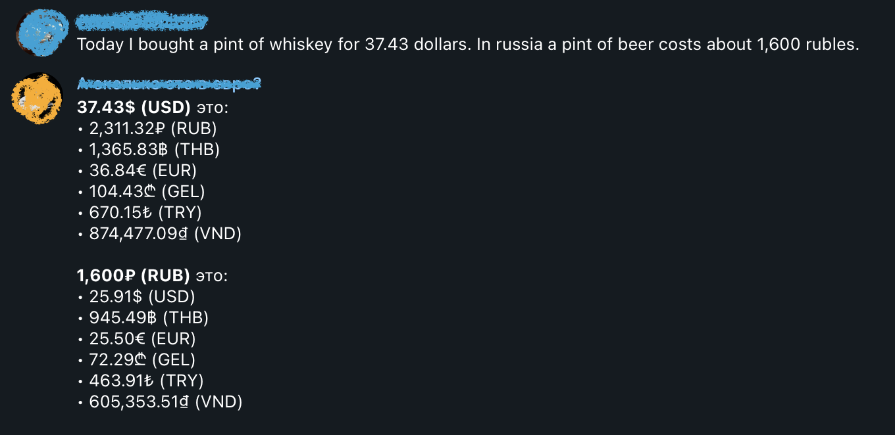

# "How Much Euro" Telegram Bot

This bot is dedicated to help quickly convert currencies.

It consumes APILayer ExchangeRates API (exchangeratesapi.io), but can be updated to use any other source.

## Purpose

While chatting with my friends living in different countries it always been hard for us to convert prices in mind,
so this bot was developed to solve this issue. It reads chat messages, finds currency patterns and
automatically converts them to interested currencies.



## Features

- Built on a top of AWS Lambda
- Chats whitelisting (allow only to work in specified chats)
- Customization of parsing rules and supported currencies

## Prerequisites

1. AWS credentials configured
2. Node.js (v16.x.x)
3. Yarn

## Usage

1. Create telegram bot using @BotFather and allow reading chat messages for it.
2. Create `.env` configuration file (use `env-example` as reference)
3. Define supported currencies and parsing rules in `src/config/price-parser.ts`
4. Deploy your application:
```
$ yarn deploy --profile=<YOUR_PROFILE_HERE>
```
5. Set bot webhook (API url will be provided to you after the previous step):
```
yarn webhook https://<YOUR_API_ID_HERE>.execute-api.eu-central-1.amazonaws.com/dev/
```

## License

MIT License

Copyright (c) 2022 Artem Bronitskii

Permission is hereby granted, free of charge, to any person obtaining a copy
of this software and associated documentation files (the "Software"), to deal
in the Software without restriction, including without limitation the rights
to use, copy, modify, merge, publish, distribute, sublicense, and/or sell
copies of the Software, and to permit persons to whom the Software is
furnished to do so, subject to the following conditions:

The above copyright notice and this permission notice shall be included in all
copies or substantial portions of the Software.

THE SOFTWARE IS PROVIDED "AS IS", WITHOUT WARRANTY OF ANY KIND, EXPRESS OR
IMPLIED, INCLUDING BUT NOT LIMITED TO THE WARRANTIES OF MERCHANTABILITY,
FITNESS FOR A PARTICULAR PURPOSE AND NONINFRINGEMENT. IN NO EVENT SHALL THE
AUTHORS OR COPYRIGHT HOLDERS BE LIABLE FOR ANY CLAIM, DAMAGES OR OTHER
LIABILITY, WHETHER IN AN ACTION OF CONTRACT, TORT OR OTHERWISE, ARISING FROM,
OUT OF OR IN CONNECTION WITH THE SOFTWARE OR THE USE OR OTHER DEALINGS IN THE
SOFTWARE.

